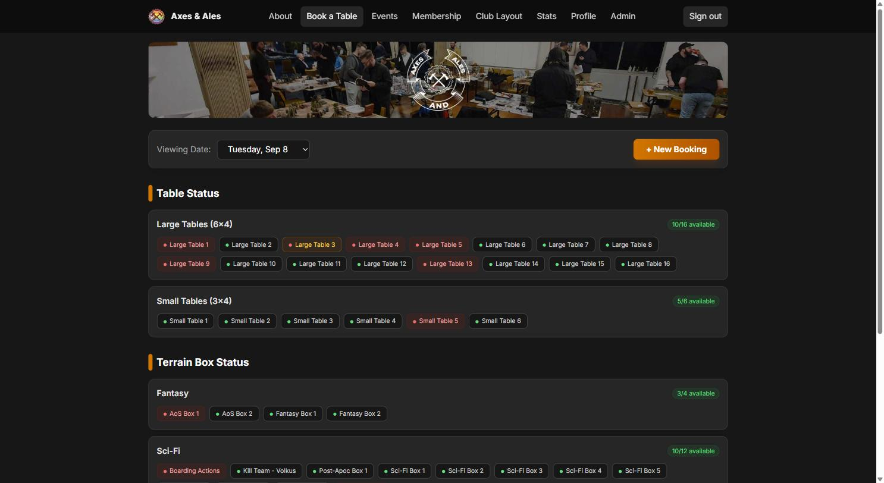

# Axes & Ales

Booking and membership system for a Melbourne tabletop gaming social club.
Live at [axesandales.club](https://www.axesandales.club).



## Why

The club ran on Booqable plus a spreadsheet. Booqable is built for equipment rental rather than table
bookings, and the fit showed: members couldn't edit or cancel their own bookings, there was no public
view of what was on — availability was only visible by walking through the booking flow — and the
committee had to open every booking individually to work out who had which table each week.
Cancelling was possible in theory, but only by the one committee member with backend access, so in
practice members posted in a Discord channel and someone removed the booking by hand. Paid membership
was tracked separately, also by hand.

Replacing both let the club move from financial-year memberships to rolling twelve-month ones. That
wasn't really a technical limitation so much as an administrative one: tracking expiry dates manually
for every member made rolling renewals impractical. Expiry reminders now go out automatically.

## What it does

- **Table bookings** — 16 large (6×4) and 6 small (3×4) tables, with per-night availability visible to
  anyone, signed in or not
- **Terrain box bookings** — fantasy and sci-fi terrain sets bookable alongside a table
- **Membership** on rolling twelve-month terms, with automated expiry reminders
- **Swap meet stall bookings**, with member pricing calculated and validated server-side
- **Events**, club layout and usage stats
- Member and admin accounts, with roles enforced in Firestore security rules
- Transactional email: Firestore `mail` collection → `firestore-send-email` extension → Resend

## Stack

React + TypeScript, built with Vite and deployed to GitHub Pages. Firebase for the backend — Firestore,
Cloud Functions v2, Auth and Cloud Storage. Tailwind for styling, Vitest for tests, GitHub Actions for
CI/CD on push to `main`.

## Notes on how it's built

**Bookings are readable without an account.** That's deliberate — anyone can see what's on and how busy
the club is without signing up. Writes are restricted to the booking's owner or an admin.

**Business rules that involve money are validated in security rules, not the client.** Swap meet pricing
recomputes the member discount server-side rather than trusting the amount a client sends.

**This project is built AI-first, with the constraints written down rather than held in my head.** See
[`agents.md`](./agents.md) for the full set. The short version: agent work is confined to self-contained,
independently testable units — pure functions against Firestore, pure presentational components —
secrets never live in source, and the CI pipeline enforces that rather than my own vigilance.

## Running locally

```bash
npm install
cd functions && npm install && cd ..

cp .env.example .env.local   # fill in your Firebase config

npm run dev
```

## Tests

```bash
npm test              # unit tests
npm run test:emulator # integration tests against the Firestore emulator
```

Linting is `npm run lint` (frontend) and `npm run lint` inside `functions/`. Both run at zero warnings.
